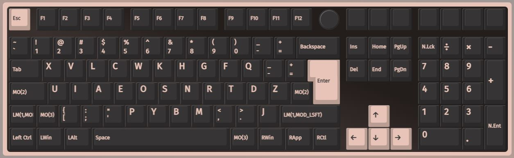
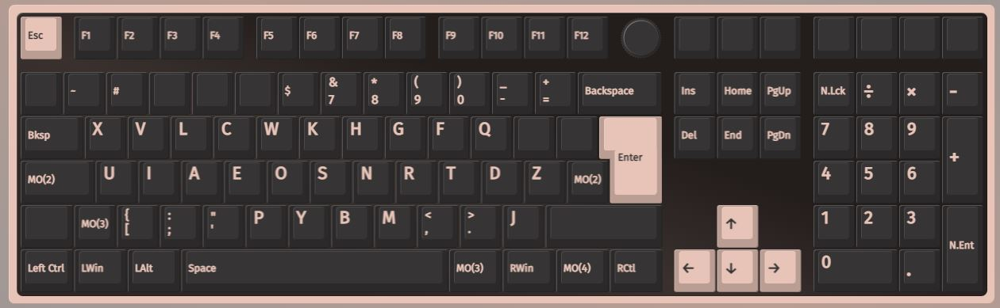
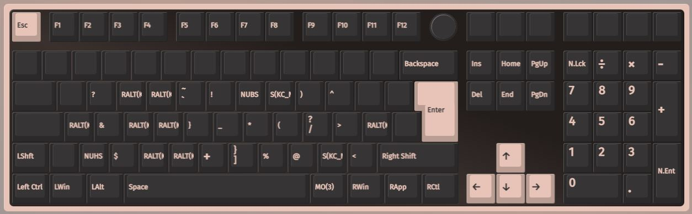
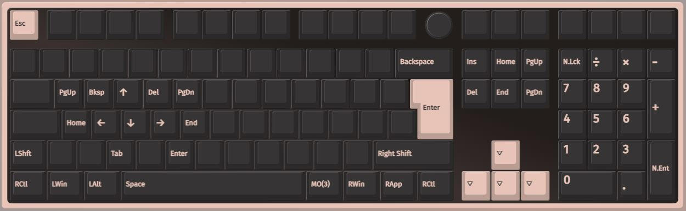

# Keychron V6 ISO KNOB

## Status:
- Work in progress 
- Rsable

## Usage: 
- Open the Via configuration Website
- Create a backup of your current layout
- Note down your "vendorProductId" from your exported data
- Insert your vendorProductId into this configuration
- Switch to "Mac-Mode", the actual plattform you are using is irrelevant.
- Upload your modified configuration

## Mapping: 

## Issues: 

- Sometimes after leaving a layer, the letter "a" is typed
- Layer 5 / 6 are not implemented, and won't be implemented as long as I don't need those personally
- The keyboard's mac / pc switch can't be used any more 
- Most likely this configuration is not usable for a mac